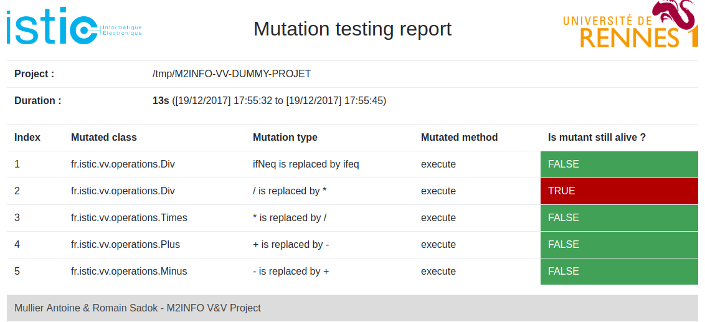

# Mutation testing project
[](https://coveralls.io/github/amullier/M2INFO-VV-PROJET?branch=master)

_Antoine Mullier & Romain Sadok_

----------------

## Build the project
The project use **Maven** to build the project use  : <code>mvn install</code>

## Dummy project
A dummy project was created for testing and development (Github available [here](https://github.com/amullier/M2INFO-VV-DUMMY-PROJET))

It groups together a few classes, exceptions and unit tests.

To import and compile this project you can use :
``` java
    ./init_project.sh [TARGET_DIRECTORY]
```

### Launch the project
To launch the project you need a target project (using a Maven architecture) and define the
path of the root project directory (relative or absolute) as the first Main parameter.

``` java
java -classpath ./target/vv_projet-1.0-SNAPSHOT-jar-with-dependencies.jar fr.istic.vv.main.Main [PROJECT_DIRECTORY]
```

The program analyse your project with Mutation testing methods and **it can take a while**.

### Reporting
When the algorithm finished, you will find two types of report in the reports folder.

#### CSV
It is the basic format not human friendly but useful to interpret mutation testing result by another program

#### HTML
This regroup basic information like in CSV format but with a better readability. It also shows the 
time execution duration. 

